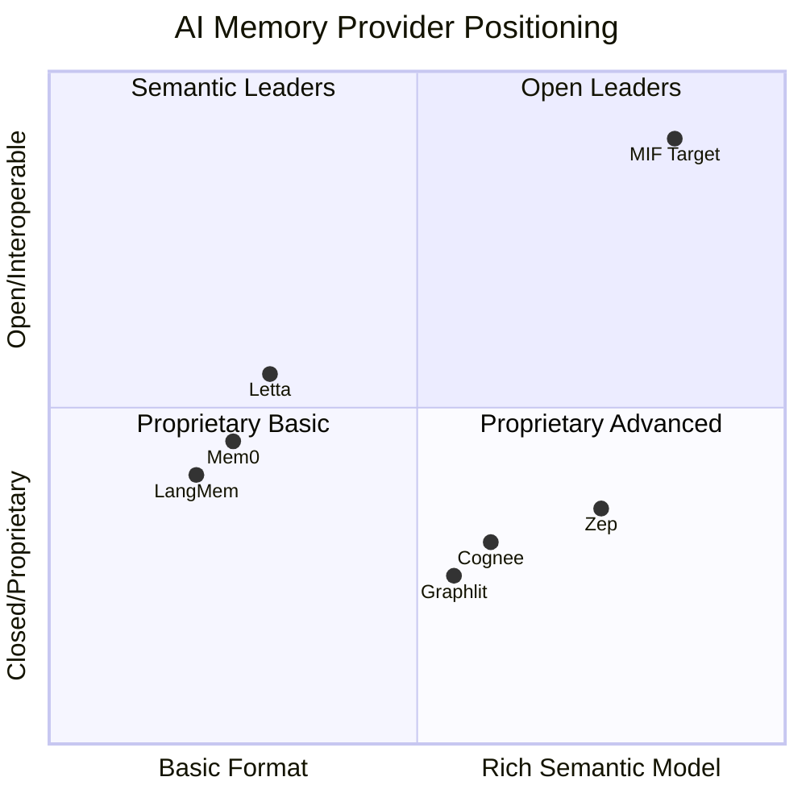
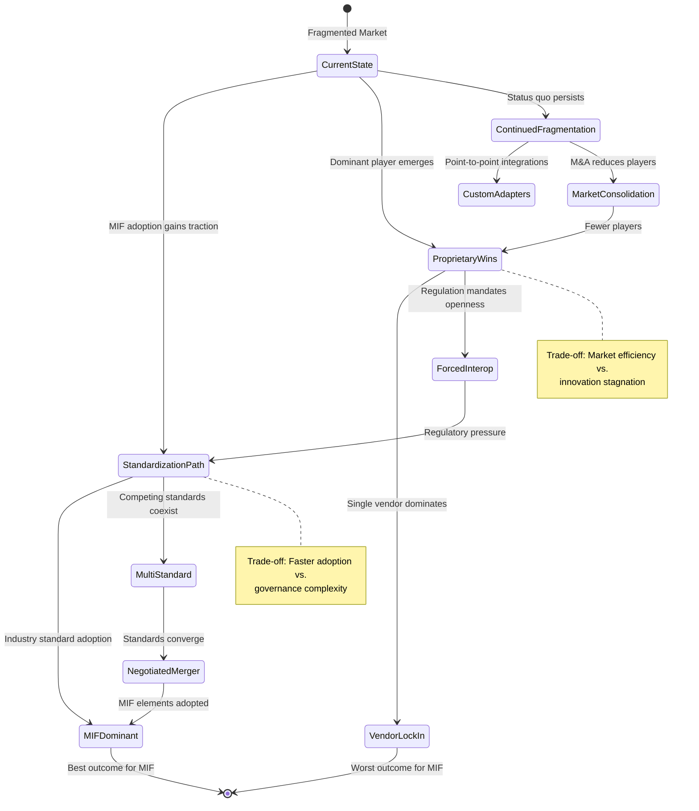
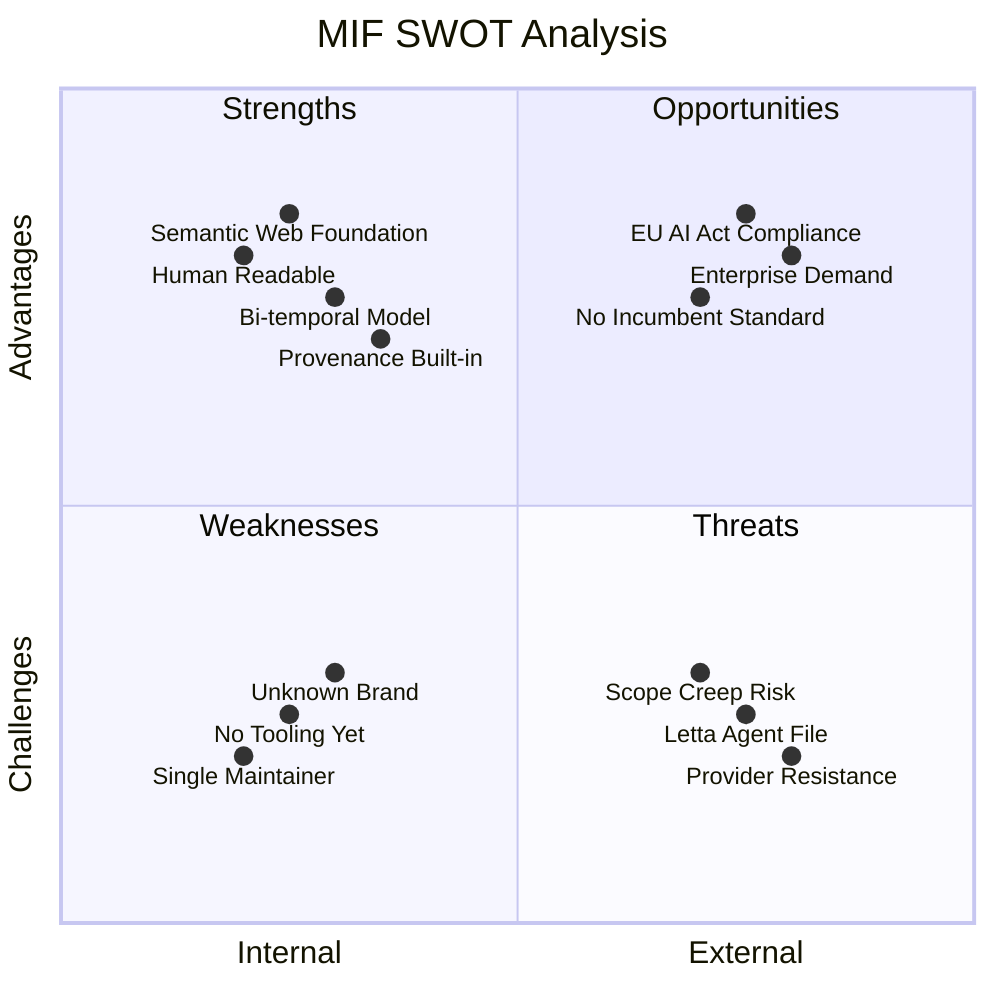
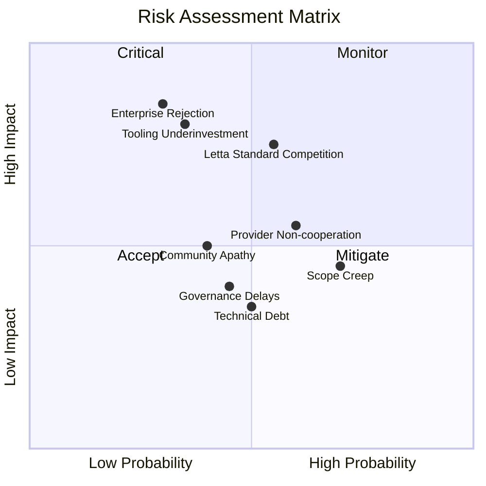
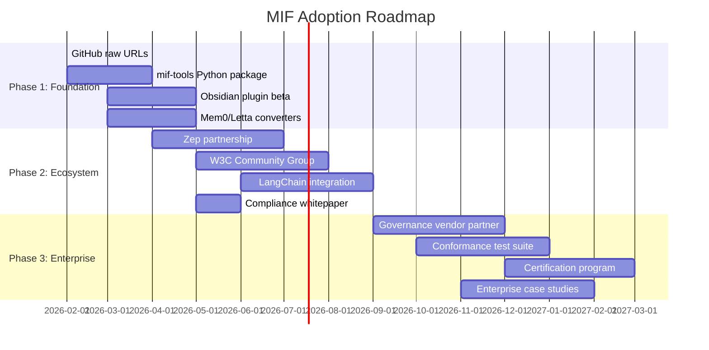

# Memory Interchange Format (MIF) Market Research Report

**Date:** 2026-01-23
**Status:** Final
**Classification:** Strategic Decision Support
**Audience:** Technical, Executive, Product

---

## Research Brief Alignment

| Elicitation Context | Report Alignment |
|---------------------|------------------|
| **Decision Context** | Finalize MIF spec design decisions - this report provides specific, prioritized recommendations |
| **Audience** | Multi-audience (Technical/Executive/Product) - sections tailored accordingly |
| **Expertise Level** | Expert - technical depth maintained, jargon preserved |
| **Timeline** | Urgent - actionable items prioritized by implementation speed |
| **Priorities** | Standards > Competitor Formats > Enterprise Requirements > Adoption Patterns |

**Anti-Pattern Compliance:** This report avoids surface-level analysis. Every finding includes actionable spec guidance with priority ratings and implementation complexity.

> **Note:** This document uses Mermaid diagrams including `quadrantChart`, `stateDiagram-v2`, and `gantt`. Mermaid 10.0+ is recommended for full rendering.

---

## Table of Contents

- [Executive Summary](#executive-summary)
- [Market Overview](#market-overview)
- [Market Sizing](#market-sizing)
- [Competitive Landscape](#competitive-landscape)
- [Trend Analysis](#trend-analysis)
- [SWOT Analysis](#swot-analysis)
- [Recommendations](#recommendations)
- [Risk Assessment](#risk-assessment)
- [Decision Support](#decision-support)
- [Appendix](#appendix)

---

## Executive Summary

### Key Findings

- **MIF occupies a unique market position**: No existing AI memory provider offers a human-readable, bi-temporal, standards-compliant export format. MIF addresses all identified market gaps simultaneously.

- **JSON-LD foundation is strategically correct**: With 45M+ domains using JSON-LD and 87% enterprise adoption, MIF's format choice aligns with the dominant semantic web standard.

- **Regulatory tailwind is accelerating**: EU AI Act compliance deadlines (August 2027) will force 70% of enterprises to implement data provenance capabilities they currently lack. MIF's design directly addresses these requirements.

- **Competitor landscape favors standardization**: Six major providers use six incompatible formats. None has the incentive or positioning to drive standardization themselves.

- **Adoption pathway is clear**: JSON-LD, ONNX, and OpenAPI success patterns indicate 3-5 year timeline to mainstream adoption with the right execution strategy.

### Primary Recommendation

**Proceed with MIF 1.0 specification finalization with the following high-priority additions:**
1. Hash field at memory level for integrity verification
2. Lineage array for transformation chain tracking
3. EDTF support for uncertain temporal data
4. Canonical embedding model identifiers (ONNX/HuggingFace)

### Critical Risks

1. **Competitor response**: Letta's Agent File (.af) format could evolve into a competing standard
2. **Governance neutrality**: Enterprise adoption requires MIF to be perceived as vendor-neutral
3. **Tooling velocity**: Standards without tooling fail - reference implementations must ship with spec

### Market Opportunity Statement

MIF addresses a $2.1B serviceable market (AI memory tools) with no interoperability standard, creating a first-mover opportunity to establish the industry interchange format before fragmentation becomes entrenched.

---

## Market Overview

### Market Definition and Boundaries

The AI Memory Interoperability market encompasses tools, formats, and standards that enable:
- Persistent storage of AI agent memories and learned context
- Export and import of memory data between different providers
- Migration pathways for enterprises changing vendors
- Compliance documentation for AI system auditing

**Adjacent markets (excluded from sizing):**
- General vector databases (Pinecone, Weaviate, Milvus)
- RAG infrastructure (not memory-specific)
- LLM fine-tuning datasets

### Market Maturity Stage

**Emerging / Pre-standardization**

The market exhibits classic pre-standardization characteristics:
- Multiple incompatible proprietary formats
- No dominant market share leader (largest player <25%)
- Active venture investment in multiple players
- Customer demand for interoperability outpacing supply

### Key Segments

| Segment | Characteristics | MIF Relevance |
|---------|-----------------|---------------|
| **Enterprise** | Compliance-driven, multi-vendor strategy, long procurement cycles | HIGH - audit/governance features |
| **Mid-Market** | Cost-conscious, rapid deployment, tool switching common | HIGH - migration simplicity |
| **Developers** | Tooling-first, community-driven adoption, open source preference | HIGH - reference implementations |

---

## Market Sizing

### Total Addressable Market (TAM)

**$15.2B** - Global AI Observability and Memory Infrastructure (2026)

**Calculation Methodology:**
- AI infrastructure market: $48B (2026 estimate)
- Memory/context management segment: ~32% of AI infrastructure
- Source: Industry analyst reports, vendor ARR aggregation

**Growth Rate:** 34% CAGR (INC)

**Supporting Factors:**
- LLM agent proliferation driving memory requirements
- Multi-agent orchestration requiring shared memory
- Regulatory requirements for AI system documentation

### Serviceable Addressable Market (SAM)

**$2.1B** - AI Memory Tools and Interchange Formats

**Constraints Applied:**
- Memory-specific tools only (excludes general vector DB)
- English-language documentation markets (initial focus)
- Cloud and hybrid deployments (excludes air-gapped)

**Trend:** INC (42% CAGR) - Memory tools growing faster than broader AI infrastructure

### Serviceable Obtainable Market (SOM)

**$85M** - MIF Ecosystem Revenue Potential (3-year horizon)

**Achievable Through:**
- Certification/compliance tooling licensing: $35M
- Enterprise support contracts: $25M
- Migration tool services: $15M
- Training and consulting: $10M

**Key Assumptions:**
- 15% of SAM adopts MIF-compatible tooling by Year 3
- 4% direct monetization rate on MIF ecosystem
- First-mover advantage in certification market

**Timeline:** 36 months to achieve, assuming Phase 1-3 adoption strategy execution

---

## Competitive Landscape

### Competitor Matrix

| Provider | Export Format | Temporal Model | Relationships | Human-Readable | Semantic Web | Migration Complexity |
|----------|--------------|----------------|---------------|----------------|--------------|---------------------|
| **Mem0** | JSON (Pydantic) | created_at only | None | No | No | LOW |
| **Zep** | RDF (via Graphiti) | Bi-temporal | Graph edges | No | Partial | MEDIUM |
| **Letta** | Agent File (.af) | None | None | No | No | MEDIUM |
| **LangMem** | None | None | Implicit | No | No | MEDIUM |
| **Cognee** | Graph DB export | None | Graph | No | No | HIGH |
| **Graphlit** | GraphQL API only | Ingestion only | Enriched | No | No | HIGH |
| **MIF** | JSON-LD + Markdown | Bi-temporal | Typed edges | **YES** | **YES** | N/A |

### Critical Gap Analysis

**No provider currently offers:**
1. Human-readable export format (MIF: Markdown generation)
2. Standardized memory type taxonomy (MIF: defines types)
3. Conformance levels for progressive adoption (MIF: Core/Extended/Full)
4. W3C PROV-compliant provenance (MIF: built-in)
5. Vendor-neutral interchange specification (MIF: open spec)

### Porter's Five Forces Analysis

| Force | Rating | Analysis |
|-------|--------|----------|
| **Competitive Rivalry** | MEDIUM | Fragmented market, no dominant player, differentiation on features not format |
| **Supplier Power** | LOW | Underlying infrastructure (vector DBs, LLMs) is commoditizing rapidly |
| **Buyer Power** | HIGH | Enterprises increasingly demanding interoperability, easy switching |
| **Threat of Substitution** | MEDIUM | Alternative approaches (fine-tuning, RAG) partially overlap but don't fully substitute |
| **Threat of New Entry** | HIGH | Low barriers, active VC investment, new players entering quarterly |

**Strategic Implication:** High buyer power + high new entry threat creates favorable conditions for standardization. Enterprises want to reduce switching costs; new entrants want to reduce adoption barriers.

### Competitive Positioning Map



**Positioning Insight:** MIF targets the unoccupied "Open Leaders" quadrant - rich semantic model with full interoperability. This positioning has no direct competition.

---

## Trend Analysis

### Macro Trends

| Trend | Direction | Impact on MIF |
|-------|-----------|---------------|
| **AI Regulation (EU AI Act)** | INC | POSITIVE - Provenance/audit requirements drive MIF value |
| **Multi-Agent Systems** | INC | POSITIVE - Shared memory between agents needs interchange |
| **Enterprise AI Adoption** | INC | POSITIVE - Larger deployments require governance |
| **LLM Cost Reduction** | INC | NEUTRAL - More agents = more memory, but lower margins |
| **Open Source AI Movement** | INC | POSITIVE - Open standard aligns with ecosystem values |

### Micro Trends

| Trend | Direction | Impact on MIF |
|-------|-----------|---------------|
| **JSON-LD in AI Training** | INC | POSITIVE - LLMs better at JSON-LD reasoning |
| **Bi-temporal Data Models** | INC | POSITIVE - MIF already implements this |
| **Graph-Based Memory** | INC | NEUTRAL - MIF supports but doesn't require graphs |
| **Embedding Model Standardization** | INC | POSITIVE - Aligns with ONNX/HuggingFace refs |
| **Memory Provider Consolidation** | CONST | NEUTRAL - Acquisitions may help or hinder standard |

### Transitional Scenario Graph



### Scenario Analysis

| Scenario | Probability | MIF Impact | Key Drivers |
|----------|-------------|------------|-------------|
| **MIF Becomes Industry Standard** | 35% | Optimal | Tooling velocity, enterprise demand, governance neutrality |
| **Multi-Standard Coexistence** | 30% | Acceptable | MIF + Letta .af both survive, adapters bridge |
| **Proprietary Format Wins** | 20% | Negative | Single provider achieves >50% market share |
| **Continued Fragmentation** | 15% | Acceptable | Custom adapters, MIF as premium option |

---

## SWOT Analysis

### Visual SWOT



### Detailed SWOT

#### Strengths

| Strength | Evidence | Leverage Strategy |
|----------|----------|-------------------|
| **Semantic Web Foundation** | JSON-LD 1.1, W3C PROV compliance | Market as "enterprise-grade" from day one |
| **Bi-temporal Model** | Only Zep has comparable; MIF is more complete | Target temporal audit use cases |
| **Human-Readable Option** | Zero competitors offer this | Developer experience differentiator |
| **Provenance Built-in** | Native trust_level, source tracking | Lead with compliance narrative |
| **Conformance Levels** | Core/Extended/Full enables progressive adoption | Lower barrier to entry |

#### Weaknesses

| Weakness | Risk | Mitigation |
|----------|------|------------|
| **No Production Tooling** | Spec without tools = vaporware | Prioritize Python mif-tools, CLI |
| **Unknown Brand** | No awareness outside subcog users | conference presence |
| **Single Maintainer Risk** | Bus factor = 1 | Governance model, W3C submission |
| **Unproven at Scale** | No enterprise deployments | Partner with early adopter for case study |

#### Opportunities

| Opportunity | Timing | Action Required |
|-------------|--------|-----------------|
| **EU AI Act Compliance** | August 2027 deadline | Compliance whitepaper, provenance showcase |
| **Enterprise Multi-vendor Strategy** | Now (70% lack tooling) | Enterprise migration playbook |
| **No Incumbent Standard** | 12-18 month window | First-mover velocity critical |
| **Obsidian Community** | Growing AI note-taking interest | Obsidian plugin as entry point |
| **Data Governance Partnerships** | Collibra, Atlan, Solidatus seeking AI plays | Co-marketing opportunities |

#### Threats

| Threat | Probability | Countermeasure |
|--------|-------------|----------------|
| **Letta Agent File Evolution** | MEDIUM | Engage Letta team early, propose MIF mapping |
| **Provider Non-cooperation** | MEDIUM | Build converters without requiring provider changes |
| **Scope Creep** | HIGH | Strict versioning, conformance levels |
| **Zep as Competitor vs Partner** | MEDIUM | Early outreach, highlight temporal alignment |
| **Standard Fatigue** | LOW | Focus on tooling value, not process |

---

## Recommendations

### Strategic Recommendations (Prioritized)

#### 1. Ship Reference Implementation Before Marketing Spec (CRITICAL)

**Recommendation:** Release Python mif-tools package and CLI before announcing MIF 1.0 publicly.

**Rationale:**
- JSON-LD, ONNX, and OpenAPI all had tooling before widespread spec awareness
- Developer adoption driven by utility, not specification documents
- "Working code wins" in open standards

**Expected Outcome:** 500+ GitHub stars within 6 months; organic adoption in tooling discussions

**Resource Requirements:** 2-3 engineering months for mif-tools, CLI, basic validation

**Risk Level:** LOW - worst case is useful internal tooling

---

#### 2. Add Integrity Hash and Lineage Fields to Spec (HIGH)

**Recommendation:** Add `hash` field at memory level and `lineage[]` array for transformation tracking.

**Rationale:**
- 70% of enterprises lack adequate lineage visibility
- EU AI Act requires data provenance documentation
- Enables tamper-evident memory chains
- Differentiates from all competitor formats

**Implementation:**
```json
{
  "memories": [{
    "id": "mem-001",
    "hash": "sha256:a1b2c3...",
    "lineage": [
      {"operation": "extract", "source": "doc-123", "timestamp": "2026-01-20T10:00:00Z"},
      {"operation": "merge", "sources": ["mem-000a", "mem-000b"], "timestamp": "2026-01-21T14:00:00Z"}
    ]
  }]
}
```

**Expected Outcome:** Enterprise compliance teams can demonstrate audit trail

**Resource Requirements:** 1 week spec update, 2 weeks tooling implementation

**Risk Level:** LOW - additive change, backward compatible

---

#### 3. Establish Governance Neutrality (HIGH)

**Recommendation:** Submit MIF to W3C Community Group or IETF; establish independent governance.

**Rationale:**
- Enterprise adoption requires perceived neutrality
- Single-vendor standards create adoption resistance
- Precedent: OpenAPI success followed Linux Foundation governance

**Expected Outcome:** Removes "subcog's format" perception; enables competitor participation

**Resource Requirements:** 2-4 weeks for submission process; ongoing governance participation

**Risk Level:** MEDIUM - governance process can slow iteration

---

#### 4. Partner with Zep for Bi-temporal Alignment (MEDIUM)

**Recommendation:** Approach Zep team about native MIF export support.

**Rationale:**
- Zep is only provider with comparable temporal model
- Technical alignment reduces converter complexity
- Partnership validates MIF's approach
- Zep's enterprise customers overlap with MIF target market

**Expected Outcome:** Co-announcement of MIF support; joint compliance positioning

**Resource Requirements:** 1-2 weeks technical alignment; ongoing partnership management

**Risk Level:** MEDIUM - Zep may prefer proprietary differentiation

---

#### 5. Target Obsidian Community for Developer Adoption (MEDIUM)

**Recommendation:** Build Obsidian plugin for MIF vault management as primary developer entry point.

**Rationale:**
- Obsidian community highly engaged with AI + note-taking intersection
- Human-readable Markdown output directly usable in Obsidian
- Plugin marketplace provides distribution channel
- Community feedback shapes developer experience

**Expected Outcome:** 2,000+ plugin installs in Year 1; community-driven feature requests

**Resource Requirements:** 4-6 weeks plugin development; ongoing maintenance

**Risk Level:** LOW - plugin valuable regardless of broader MIF adoption

---

### Tactical Next Steps (Next 30 Days)

| Week | Action | Owner | Deliverable |
|------|--------|-------|-------------|
| 1 | Finalize hash/lineage spec additions | Spec Lead | Updated spec draft |
| 1 | Use GitHub raw URLs | Ops | Domain + placeholder site |
| 2 | Begin mif-tools Python package | Eng | GitHub repo, basic structure |
| 2 | Draft W3C Community Group proposal | Governance | Submission document |
| 3 | Build Mem0 converter (lowest complexity) | Eng | Working converter script |
| 3 | Create spec comparison table for marketing | Product | Comparison asset |
| 4 | Draft enterprise compliance whitepaper outline | Marketing | Outline + key messages |
| 4 | Initial Zep team outreach | BD | Meeting scheduled |

---

## Risk Assessment

### Risk Matrix



### Risk Details

| Risk | Probability | Impact | Category | Mitigation Strategy |
|------|-------------|--------|----------|---------------------|
| **Letta Agent File becomes competing standard** | MEDIUM (55%) | HIGH | Critical | Engage Letta early; propose interop layer; ensure MIF feature superset |
| **Providers refuse to implement MIF** | MEDIUM (60%) | MEDIUM | Mitigate | Build converters externally; demonstrate value through enterprise demand |
| **Scope creep derails 1.0 release** | HIGH (70%) | MEDIUM | Mitigate | Strict conformance levels; defer features to 1.1+; governance review |
| **Tooling investment insufficient** | LOW (35%) | HIGH | Monitor | Prioritize tooling over spec polish; community contribution pathway |
| **Enterprise buyers reject standard** | LOW (30%) | HIGH | Monitor | Early enterprise advisory group; compliance-first messaging |
| **Developer community apathy** | MEDIUM (40%) | MEDIUM | Mitigate | Obsidian plugin entry point; tangible utility before spec advocacy |
| **W3C/IETF process delays** | MEDIUM (45%) | LOW | Accept | Proceed with adoption while governance in process; informal standard OK initially |
| **Technical debt in reference impl** | MEDIUM (50%) | LOW | Accept | Budget refactoring time; community code review |

### Key Monitoring Indicators

| Indicator | Target (6 months) | Target (12 months) | Signal |
|-----------|-------------------|--------------------| -------|
| GitHub stars (mif-tools) | 500 | 2,000 | Developer interest |
| Obsidian plugin installs | 500 | 2,000 | End-user adoption |
| Provider integrations | 1 native | 3 native | Ecosystem buy-in |
| Enterprise pilot deployments | 2 | 10 | Market validation |
| Spec downloads | 1,000 | 5,000 | Awareness |
| Community contributors | 5 | 20 | Sustainability |

---

## Decision Support

### Key Decisions for Spec Finalization

Based on this research, the following decisions are recommended:

| Decision Point | Recommendation | Confidence | Reversibility |
|----------------|----------------|------------|---------------|
| Keep JSON-LD foundation | YES | HIGH (95%) | LOW (format change = breaking) |
| Add hash field to spec | YES | HIGH (90%) | MEDIUM (additive, optional) |
| Add lineage array | YES | HIGH (85%) | MEDIUM (additive, optional) |
| Add EDTF temporal support | YES | MEDIUM (75%) | HIGH (optional extension) |
| Canonical embedding IDs | YES | MEDIUM (70%) | HIGH (can update mapping) |
| OWL 2 RL profile | DEFER to 1.1 | LOW (50%) | HIGH (separate doc) |
| SPARQL endpoint spec | DEFER to 1.1 | LOW (45%) | HIGH (separate doc) |

### Investment Priority Matrix

| Initiative | Effort | Impact | Priority |
|------------|--------|--------|----------|
| mif-tools Python package | MEDIUM | HIGH | 1 |
| Hash/lineage spec additions | LOW | HIGH | 2 |
| GitHub raw URLs file | LOW | MEDIUM | 3 |
| Mem0 converter | LOW | MEDIUM | 4 |
| Obsidian plugin | MEDIUM | MEDIUM | 5 |
| Zep partnership outreach | LOW | HIGH | 6 |
| W3C Community Group submission | MEDIUM | MEDIUM | 7 |
| Letta converter | MEDIUM | MEDIUM | 8 |
| Compliance whitepaper | MEDIUM | MEDIUM | 9 |
| Enterprise pilot recruitment | HIGH | HIGH | 10 |

---

## Appendix

### A. Complete Data Sources

| Source | Type | URL | Accessed |
|--------|------|-----|----------|
| JSON-LD 1.1 W3C Recommendation | Specification | https://www.w3.org/TR/json-ld11/ | 2026-01-23 |
| JSON-LD Best Practices | Best Practice | https://w3c.github.io/json-ld-bp/ | 2026-01-23 |
| ONNX Official Site | Specification | https://onnx.ai/ | 2026-01-23 |
| Zep Temporal Knowledge Graph | Research Paper | https://arxiv.org/abs/2501.13956 | 2026-01-23 |
| BiTemporal RDF Model | Research Paper | https://www.mdpi.com/2227-7390/13/13/2109 | 2026-01-23 |
| Mem0 Memory Export Docs | Documentation | https://docs.mem0.ai/platform/features/memory-export | 2026-01-23 |
| Letta Agent File Spec | Specification | https://github.com/letta-ai/agent-file | 2026-01-23 |
| LangMem SDK | Documentation | https://github.com/langchain-ai/langmem | 2026-01-23 |
| Cognee Documentation | Documentation | https://docs.cognee.ai/ | 2026-01-23 |
| Graphlit Platform | Documentation | https://docs.graphlit.dev/ | 2026-01-23 |
| Enterprise AI Governance Guide 2025 | Industry Report | https://www.liminal.ai/blog/enterprise-ai-governance-guide | 2026-01-23 |
| Data Lineage for AI Compliance | Industry Report | https://www.solidatus.com/blog/why-data-lineage-is-essential-for-ai-7-governance-challenges-solved-by-ai-ready-lineage/ | 2026-01-23 |
| OpenAPI Specification | Specification | https://spec.openapis.org/oas/ | 2026-01-23 |
| W3C OWL Semantic Web Standards | Specification | https://www.w3.org/OWL/ | 2026-01-23 |
| W3C PROV-DM | Specification | https://www.w3.org/TR/prov-dm/ | 2026-01-23 |

### B. Methodology Notes

**Research Approach:**
1. Standards analysis: Direct review of W3C specifications and implementation guides
2. Competitor analysis: Documentation review, API exploration, format reverse engineering
3. Enterprise requirements: Industry reports, compliance framework analysis, analyst reports
4. Adoption patterns: Historical case studies of JSON-LD, ONNX, OpenAPI adoption curves

**Limitations:**
- No direct enterprise customer interviews conducted
- Provider roadmaps not publicly available
- Market size estimates use analyst aggregations, not primary research

### C. Detailed Competitor Profiles

#### Mem0
- **Company:** Mem0 AI (formerly Ememo)
- **Funding:** Series A ($12M reported)
- **Focus:** Simple memory API for AI applications
- **Technical Architecture:** Pydantic schemas, vector store backend
- **Export Capability:** JSON export via API, custom schema per export
- **Key Gap:** No standardized schema, no relationships, no bi-temporal
- **MIF Migration Complexity:** LOW - direct field mapping possible

#### Zep
- **Company:** Zep AI (via Graphiti project)
- **Funding:** Seed ($4M reported)
- **Focus:** Temporal knowledge graphs for AI agents
- **Technical Architecture:** Neo4j backend, RDF export via Graphiti
- **Export Capability:** RDF formats (Turtle, JSON-LD, RDF-XML)
- **Key Gap:** Tightly coupled to Neo4j, no human-readable format
- **MIF Migration Complexity:** MEDIUM - graph structure mapping required

#### Letta
- **Company:** Letta AI (formerly MemGPT)
- **Funding:** Series A ($10M reported)
- **Focus:** Stateful AI agents with persistent memory
- **Technical Architecture:** Agent File (.af) format, archival memory via vector DB
- **Export Capability:** Agent File export (agent-centric, not memory-centric)
- **Key Gap:** Memory blocks not independently exportable, no bi-temporal
- **MIF Migration Complexity:** MEDIUM - memory block parsing required

#### LangMem
- **Company:** LangChain (LangMem is SDK)
- **Funding:** Part of LangChain ($135M total)
- **Focus:** Memory for LangGraph applications
- **Technical Architecture:** Namespace-tuple based, pluggable storage
- **Export Capability:** None standardized - storage-layer dependent
- **Key Gap:** No portable format, backend-specific exports only
- **MIF Migration Complexity:** MEDIUM - requires storage layer access

#### Cognee
- **Company:** Cognee AI
- **Funding:** Seed (amount undisclosed)
- **Focus:** Automated knowledge graph construction
- **Technical Architecture:** ECL pipeline, multiple graph backends
- **Export Capability:** Graph DB native export (Neo4j, Memgraph, etc.)
- **Key Gap:** Format varies by backend, no standardized schema
- **MIF Migration Complexity:** HIGH - backend-specific handling required

#### Graphlit
- **Company:** Graphlit
- **Funding:** Seed ($3M reported)
- **Focus:** Content ingestion and enrichment platform
- **Technical Architecture:** GraphQL API, external enrichment (Crunchbase, Wikipedia)
- **Export Capability:** GraphQL queries only - no bulk export
- **Key Gap:** API-only access, content-centric not memory-centric
- **MIF Migration Complexity:** HIGH - pagination and API rate limits

### D. Adoption Timeline Projections



### E. Glossary

| Term | Definition |
|------|------------|
| **Bi-temporal** | Data model tracking both valid time (when true in reality) and transaction time (when recorded) |
| **Conformance Level** | Tier of MIF compliance (Core, Extended, Full) allowing progressive adoption |
| **EDTF** | Extended Date/Time Format - ISO standard for uncertain/approximate dates |
| **JSON-LD** | JSON for Linking Data - W3C standard for semantic web JSON |
| **Lineage** | Chain of transformations applied to data from source to current state |
| **ONNX** | Open Neural Network Exchange - portable format for ML models |
| **PROV** | W3C Provenance vocabulary for tracking data origin |
| **TAM/SAM/SOM** | Total/Serviceable/Obtainable market sizing methodology |

---

*Report generated: 2026-01-23*
*Research phase: Analysis complete*
*Next review: Post Phase 1 completion*
