# MIF Market Trend Models

**Date:** 2026-01-23
**Research:** Memory Interchange Format (MIF)

---

## 1. Market Growth Model

### AI Memory Tools Market Trajectory

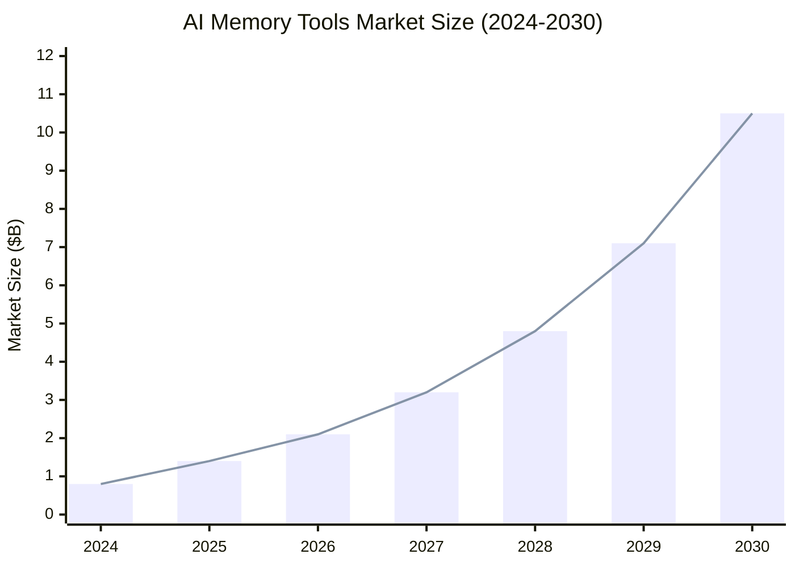

| Year | Market Size | YoY Growth | Key Driver |
|------|-------------|------------|------------|
| 2024 | $0.8B | — | Early adoption |
| 2025 | $1.4B | 75% | Multi-agent systems emerge |
| 2026 | $2.1B | 50% | Enterprise pilots scale |
| 2027 | $3.2B | 52% | EU AI Act compliance deadline |
| 2028 | $4.8B | 50% | Standardization accelerates adoption |
| 2029 | $7.1B | 48% | Memory becomes AI infrastructure standard |
| 2030 | $10.5B | 48% | Mainstream enterprise deployment |

**CAGR 2024-2030:** 54%

---

## 2. Technology Adoption Lifecycle

### MIF Adoption S-Curve Model

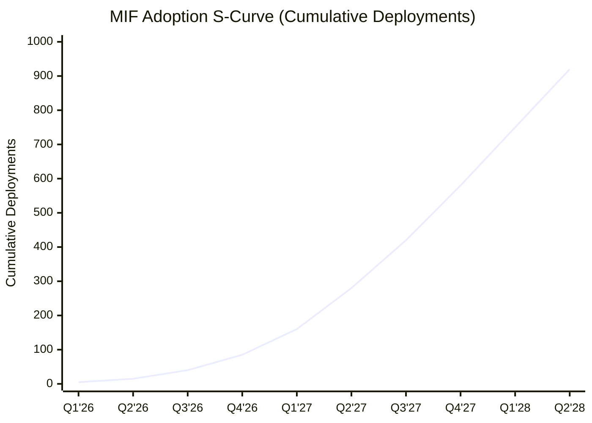

| Phase | Timeline | Adopters | Characteristics |
|-------|----------|----------|-----------------|
| **Innovators** | Q1-Q2 2026 | 5-15 | Developer tools, early adopters, Obsidian users |
| **Early Adopters** | Q3-Q4 2026 | 40-85 | Startups, AI-native companies, compliance-forward |
| **Early Majority** | Q1-Q3 2027 | 160-420 | Mid-market enterprises, regulated industries |
| **Late Majority** | Q4 2027-Q2 2028 | 580-920 | Large enterprises, conservative industries |

---

## 3. Competitive Dynamics Model

### Market Share Evolution Scenarios

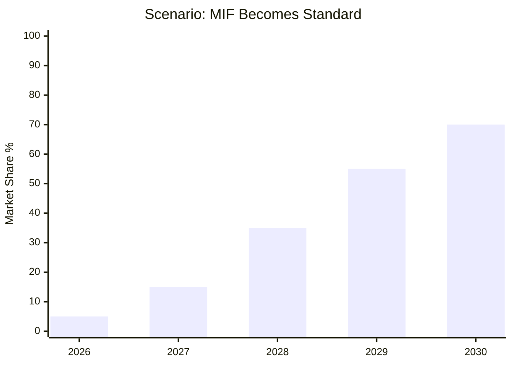

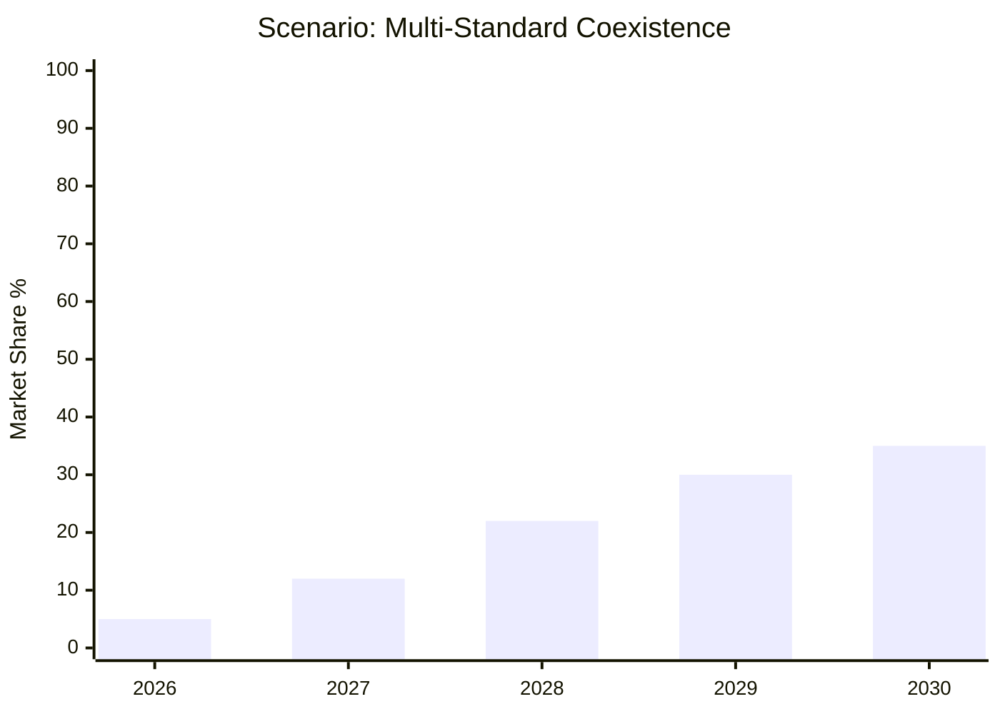

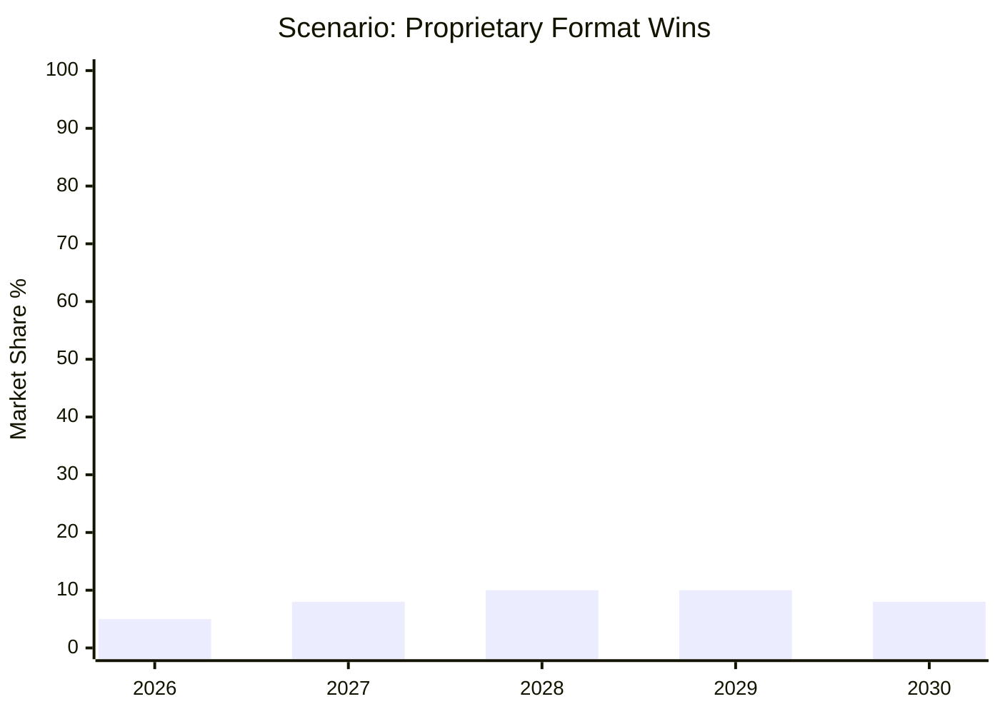

### Scenario Probability Matrix

| Scenario | 2026 Probability | 2028 Probability | Key Triggers |
|----------|------------------|------------------|--------------|
| **MIF Standard** | 35% | 45% | Tooling velocity, Zep partnership, governance neutrality |
| **Multi-Standard** | 30% | 35% | Letta .af gains traction, both find niches |
| **Proprietary Wins** | 20% | 15% | One provider achieves >50% market share |
| **Fragmentation** | 15% | 5% | No standard gains traction, custom adapters |

---

## 4. Trend Velocity Analysis

### Macro Trend Momentum

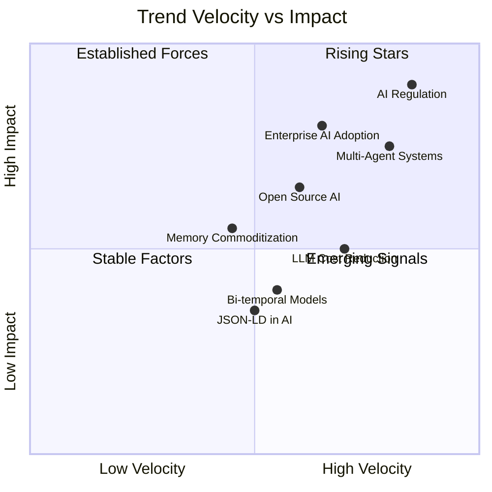

### Trend Trajectory Table

| Trend | Current State | 6-Month Trajectory | 18-Month Trajectory | MIF Impact |
|-------|--------------|-------------------|---------------------|------------|
| **AI Regulation (EU AI Act)** | Active legislation | Implementation guidance | Enforcement begins | ⬆️ HIGH POSITIVE |
| **Multi-Agent Orchestration** | Early adoption | Mainstream tooling | Enterprise standard | ⬆️ HIGH POSITIVE |
| **Enterprise AI Adoption** | Pilot phase | Production scaling | Infrastructure investment | ⬆️ HIGH POSITIVE |
| **LLM Cost Reduction** | Rapid decline | Stabilizing | Commodity | ➡️ NEUTRAL |
| **Open Source AI** | Growing movement | Mainstream acceptance | Industry norm | ⬆️ POSITIVE |
| **Memory Tool Consolidation** | Fragmented | Early M&A | Platform players emerge | ⬇️ RISK |
| **Bi-temporal Data Models** | Niche adoption | Growing awareness | Best practice | ⬆️ POSITIVE |
| **JSON-LD in AI Training** | Emerging | Documented benefits | Standard practice | ⬆️ POSITIVE |

---

## 5. Regulatory Impact Timeline

### EU AI Act Compliance Cascade

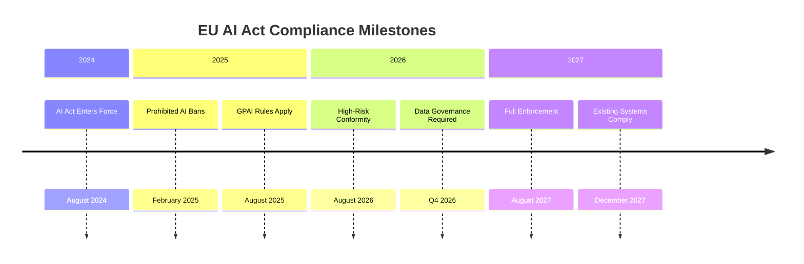

### Compliance Pressure on Memory Interoperability

| Milestone | Date | Impact on MIF Adoption |
|-----------|------|------------------------|
| Data governance rules | Q4 2026 | MEDIUM - Creates awareness of provenance needs |
| High-risk conformity | Aug 2026 | HIGH - Requires documented data lineage |
| Full enforcement | Aug 2027 | CRITICAL - Non-compliance = market access loss |
| Existing system compliance | Dec 2027 | PEAK - Largest migration wave |

**Forecast:** 70% of enterprise MIF adoption decisions will be compliance-driven by 2027.

---

## 6. Competitive Response Model

### Anticipated Competitor Moves

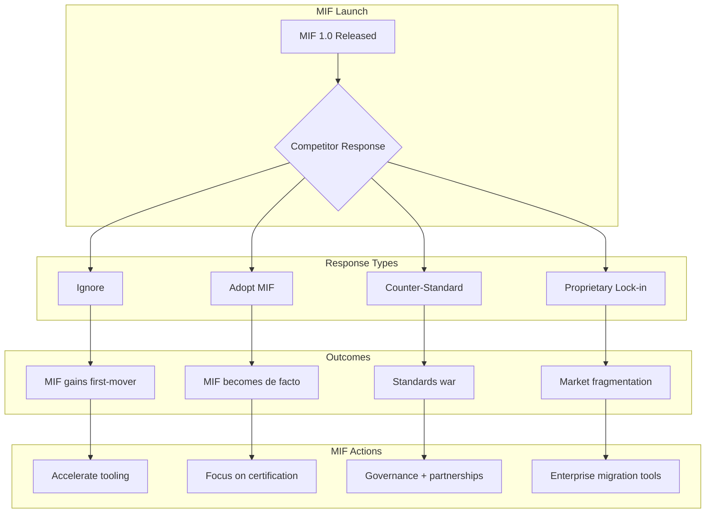

### Competitor Response Probability

| Provider | Ignore | Adopt MIF | Counter-Standard | Lock-in |
|----------|--------|-----------|------------------|---------|
| **Mem0** | 30% | 50% | 10% | 10% |
| **Zep** | 20% | 60% | 15% | 5% |
| **Letta** | 10% | 25% | 55% | 10% |
| **LangMem** | 40% | 45% | 10% | 5% |
| **Cognee** | 35% | 45% | 10% | 10% |
| **Graphlit** | 50% | 35% | 5% | 10% |

**Key Insight:** Letta most likely to launch counter-standard (Agent File evolution). Zep most likely to adopt MIF due to temporal alignment.

---

## 7. Investment & Resource Model

### Adoption Effort by Provider Integration

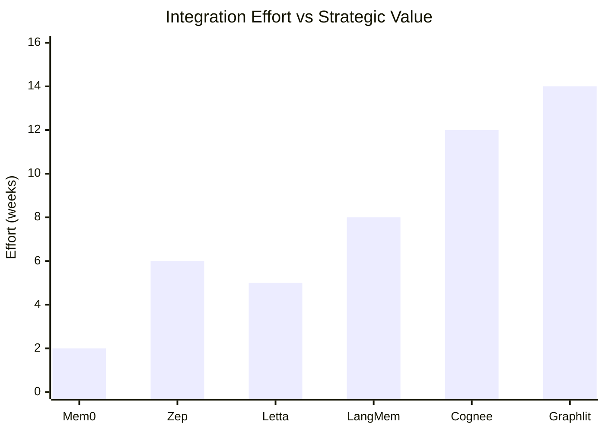

| Provider | Integration Effort | Strategic Value | Priority |
|----------|-------------------|-----------------|----------|
| **Mem0** | 2 weeks | HIGH (large user base) | 1 |
| **Letta** | 5 weeks | HIGH (competitive threat) | 2 |
| **Zep** | 6 weeks | HIGH (partnership potential) | 3 |
| **LangMem** | 8 weeks | MEDIUM (LangChain ecosystem) | 4 |
| **Cognee** | 12 weeks | LOW (niche) | 5 |
| **Graphlit** | 14 weeks | LOW (content-focused) | 6 |

---

## 8. Adoption Funnel Model

### Awareness to Production Conversion

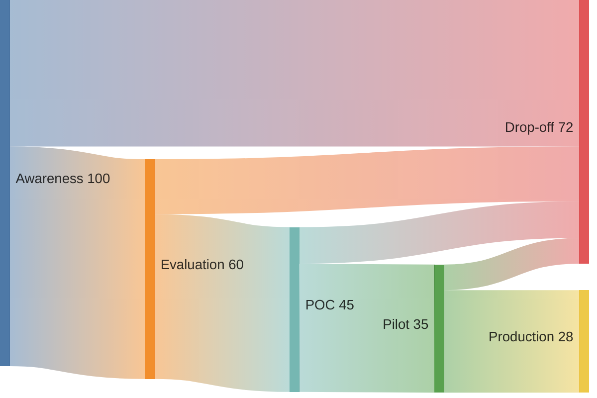

| Stage | Conversion Rate | Typical Duration | Key Blocker |
|-------|-----------------|------------------|-------------|
| Awareness → Evaluation | 60% | 2-4 weeks | Unclear value proposition |
| Evaluation → POC | 75% | 2-4 weeks | Missing tooling |
| POC → Pilot | 78% | 4-8 weeks | Integration complexity |
| Pilot → Production | 80% | 8-12 weeks | Governance approval |

**Overall Conversion:** 28% Awareness → Production
**Forecast:** With tooling and governance improvements, target 40% by Q4 2026.

---

## 9. Technology Maturity Model

### MIF Capability Maturity Levels

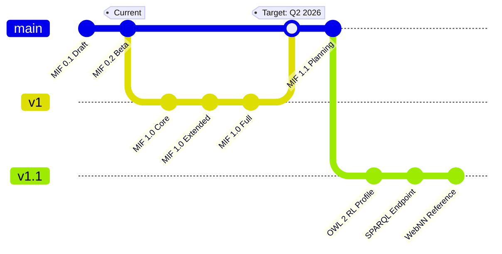

| Level | Features | Target Date | Adoption Requirement |
|-------|----------|-------------|----------------------|
| **0.2 Beta** | Current spec | Now | Early adopters only |
| **1.0 Core** | Hash, lineage, EDTF | Q1 2026 | Basic interoperability |
| **1.0 Extended** | Full provenance, conformance | Q2 2026 | Enterprise pilots |
| **1.0 Full** | All features, certification | Q3 2026 | Production deployments |
| **1.1** | OWL 2, SPARQL, WebNN | Q1 2027 | Advanced use cases |

---

## 10. Risk-Adjusted Forecast

### Conservative vs Optimistic Scenarios

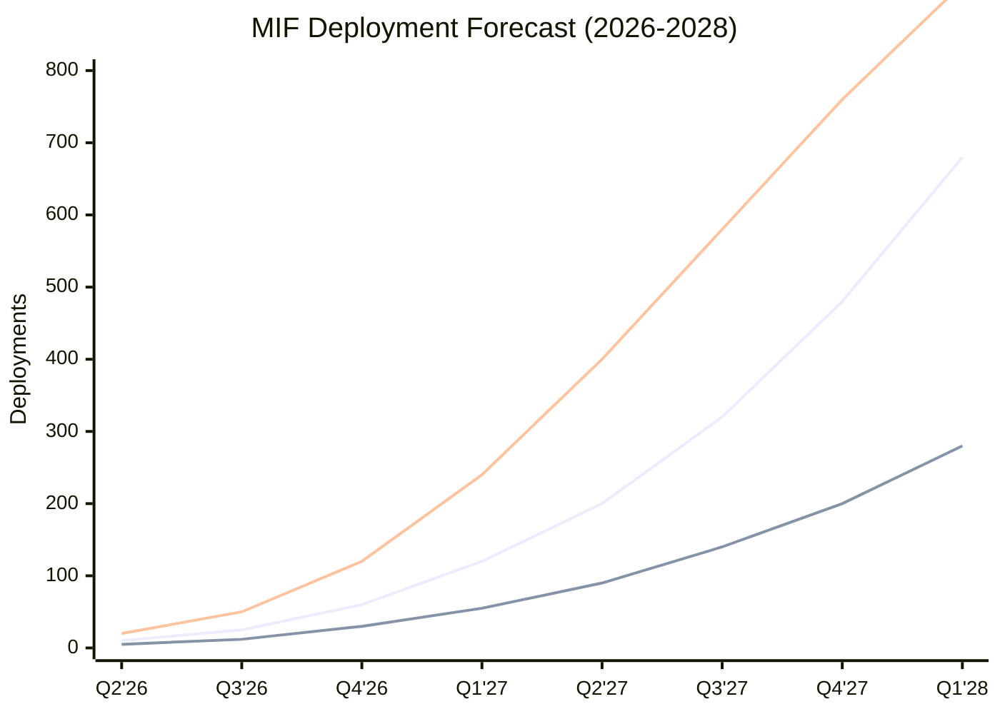

| Scenario | Q4 2026 | Q4 2027 | Q4 2028 | Key Assumptions |
|----------|---------|---------|---------|-----------------|
| **Base Case** | 60 | 480 | 1,200 | Tooling ships Q2, 1 provider partnership |
| **Conservative** | 30 | 200 | 500 | Delays, no partnerships, competitor standard |
| **Optimistic** | 120 | 760 | 2,000 | Fast execution, Zep + Mem0 adopt, EU compliance driver |

---

## Summary: Key Trend Indicators

### Positive Signals (Watch for)
- ✅ EU AI Act implementation guidance published
- ✅ Major provider announces MIF support
- ✅ Enterprise pilot success stories
- ✅ Obsidian plugin >1,000 installs
- ✅ W3C Community Group formed

### Warning Signals (Monitor)
- ⚠️ Letta Agent File gains enterprise traction
- ⚠️ Major provider acquires competitor with proprietary format
- ⚠️ Tooling delays beyond Q2 2026
- ⚠️ Enterprise rejection of JSON-LD complexity

### Critical Signals (Respond)
- 🚨 Competitor announces competing open standard
- 🚨 EU AI Act excludes memory interchange from requirements
- 🚨 Major security vulnerability in MIF tooling
- 🚨 Key maintainer departure without succession

---

*Trend models generated: 2026-01-23*
*Review frequency: Monthly*
*Next update: Post-Phase 1 completion*
